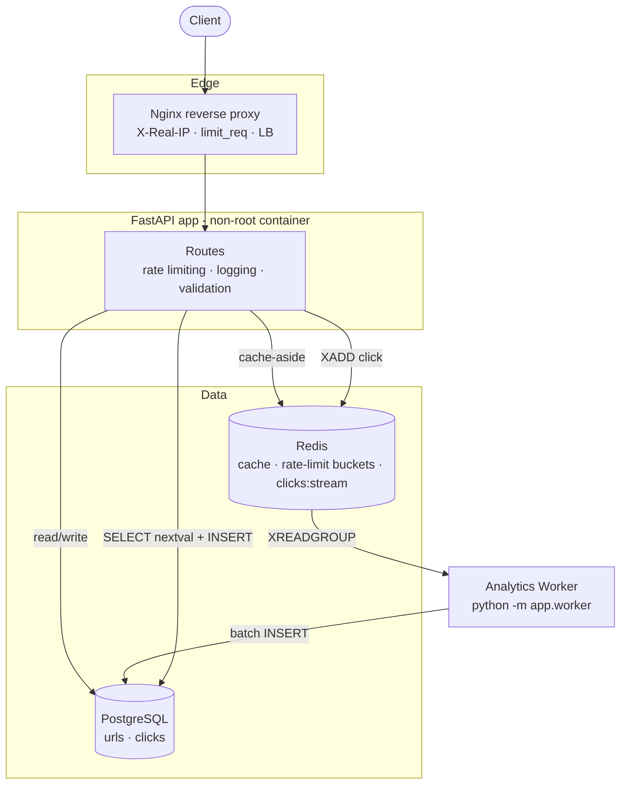

# Architecture v3 (Phase 3)

> PNG diagrams aren't generated in this repo; this Mermaid source is the
> versioned diagram. Bump to `architecture-v4` when the topology changes.

## History

- **v1:** Client → FastAPI → PostgreSQL
- **v2:** Client → FastAPI → Redis (cache-aside) → PostgreSQL
- **v3 (this):** Client → Nginx → FastAPI → Redis/PostgreSQL, + analytics worker
  draining `clicks:stream` → PostgreSQL
